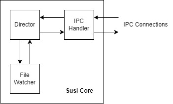

== Approach
:stem:

=== Components

==== Major Components

There will be two major components for Susi: (a) Susi Core, and (b) Susi GUI.

Susi Core is the core application that has the following responsibilities and behaviours:

- Monitors protected files and encrypts them using a password when they are no longer in use after 5 minutes.
- It is responsible for decrypting files.
- Runs in the background.
- It will use AES-256-GCM for encrypting and decrypting. The key will be based on the password for the file. Using this encryption algorithm means that data integrity is already built-in.
- The password will be hashed using Argon2. The hash is expected to be 256 bits long. This hash will then be used as the key for encrypting or decrypting protected files.
- Unprotect encrypted files, which will only proceed when the correct password was given.

On the other hand, Susi GUI is be assigned to handle user interactions. It has the following requirements:

- It will pop up during encryption and decryption to request for the password
- When a message needs to be displayed, such as when encryption fails, it will display a notification bubble to be shown to the user.
- Responsible for displaying the window that orients the user when running the app for the first time.
- Responsible for integrating with the OS's file manager.
- Displaying a list of files that are being encrypted or decrypted just like when Windows Explorer is cutting, copying, or pasting a file.

Communications between Susi GUI and Susi Core is done via IPC.

Susi Core is written in Rust, while Susi GUI written in the "standard" language for writing GUI apps of the target operating system. In Windows, this is C#. In Linux, this is C or C++. For macOS, it is Swift.

==== Architecture
.The architecture of Susi Core.

Currently, the architecture design for Susi GUI is incomplete. However, we have a design ready for Susi Core.

Susi Core has three major subcomponents: (1) the IPC Handler, (2) the File Watcher, and (3) the Director. The IPC Handler is responsible for taking requests and sending responses to any Susi clients. The File Watcher is responsible for watching any file that will be re-encrypted later. These two subcomponents communicate with the Director, which is responsible for starting and stopping tasks. The Director also communicates with the IPC Handler about updates on the tasks such as the progress of an ongoing encryption operation.

==== File Format

The file format for an encrypted file (`.ssef`) consists of three parts: (a) the file identifier, (b) the metadata, and (c) the encrypted file data. The version of the file format here is designated to be v1. This file format is designed to be compatible with any version of Susi that [.line-through]#is loyal to# supports v1 of this format.

The file identifier helps us determine if the encrypted file is a valid `.ssef` file. It takes the first 4 bytes of an encrypted file, and has the following format:

[source]
----
[0x55 0x3F]
[(format version, 2 bytes)]
----

The first two bytes is the file identifier, and the next two bytes specify the format version. The likelihood of this format reaching a version greater than 65,535 (stem:[2^16^ - 1]) is low, as such, we can safely allocate two bytes for the format version. The file identifier is stored in big-endian (for readability), while the format version is stored in little-endian (for easier processing).

The next part is the metadata. This contains any metadata we choose to add to the file that we can use during decryption. Most of the metadata is expected to be key-value pairings. This part has the following format:

[source]
----
[(length of metadata in bytes, 2 bytes)]
[(metadata ID, 2 bytes) (metadata value length (MVL), 2 bytes) (metadata content, length specified by MVL)]
[more metadata items here...]
----

In the metadata section, the first two bytes specify the length of the section after these two bytes. This gives the section a maximum of 65,536 bytes, with 65,534 bytes of it being usable. The next bytes are the metadata key-value pairs, also referred to as metadata items. The first four bytes contain the key of the pair. The first two bytes of the key contains the ID. This ID specifies what type of metadata the item is holding. In our file, it is stored in big-endian for readability reasons. Currently, we support the following IDs:

[cols="1, 4"]
|===
| Metadata ID | Description

| `0x00 0x01`
| The original *filename* of the encrypted file, including the file extension.

| `0xA5 0x19`
| The *salt* of the password used to encrypt the protected file. The hexadecimal is derived from the Filipino and Waray word for "salt", "asin". Due to the non-existence of `N` in hexadecimal symbols, we used `9` since its first letter is `N`. It just so happens as well that you may pronounce the hex codes as "asi-nine", which can be modified to "asinin". "Asinin", in Filipino, means "to salt something". ;-\)

| `0x90 0x9C`
| The *nonce* used when encrypting the original file. Used during decryption. The reasoning for the use of `9` is the same as the metadata ID for the salt.
|===

The next two bytes in the key specify the length of the metadata value in bytes. The value is stored in little-endian for easier processing on our end. This length will be referred to as the MVL. The next MVL bytes will contain the value of the metadata item.

Another metadata item may placed be after these bytes. We can also add padding bytes, denoted with `0x00`, to help with byte alignment. These paddings may help improve performance when decrypting files, but that remains to be tested.

If the specified length of the metadata section has already been reached, the encrypted data will be reached. This data is the last section of the file and will span until the end of the file. It will be the data we will be decrypting and saving into another unencrypted file. We do not specify the endianness of this data, and we will simply depend on the implementation of AES-256-GCM we use for how things are stored.

=== Security and Privacy

Encrypting and decrypting files does present the risk of losing that file forever. One case is when the file cannot be decrypted by the app. Another would be when the app, due to a glitch, accidentally deletes the file during an encryption or decryption process. Additionally, the file is vulnerable while it is decrypted and can be copied. Files may also be stolen during transit or at rest. As such, these files can be decrypted offline. This case cannot be completely solved by Susi, which can only protect the file through encryption. In the worst case, Susi may be used by malicious third parties for their own gain. Files can be encrypted by anyone and can be held as hostages. These risks must be clearly communicated to the user, particularly during installation and first run.

On the privacy side of things, there are no concerns. The app is not expected to cause any significant impact on the user privacy. The only time the app can risk the privacy of a user is when a third party successfully decrypts a user's protected file using the app, uncovering the secrets of a user deep within the file.

Susi must be written so that it does not result in the loss of valuable files. It must make sure that deletion of files will only occur when the encryption or decryption process has already succeeded.

=== Test Plan

For testing, we utilize automated testing (unit tests and integration tests) to help us ensure that the code performs as expected and reduce the risks of losing and leaking file data. We utilize GitHub Actions to automatically run these tests on every commit and pull request.

Manual testing is also utilized and select volunteers can use Susi in their own environments. Having volunteers helps us find bugs and issues that have slipped through our internal testing. Dogfooding is another method we utilize to help us find problems with the app.
